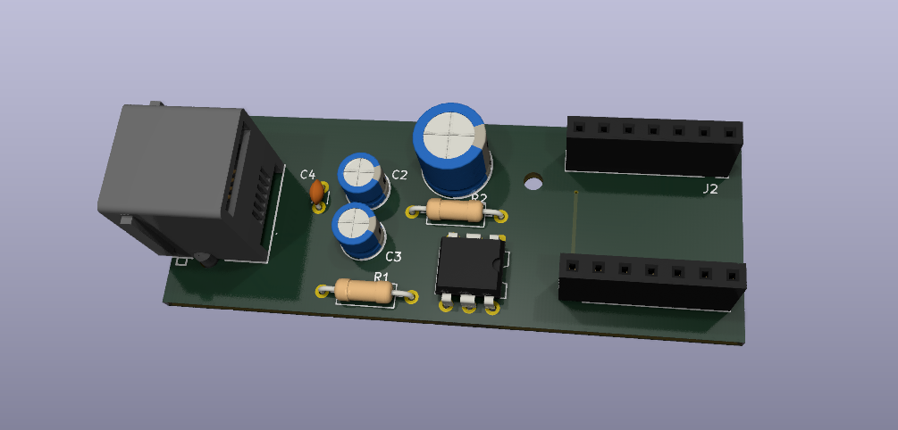

# P1 Reader

A simple device connecting a [Seeed ESP32-C3](https://wiki.seeedstudio.com/XIAO_ESP32C3_Getting_Started/) to a P1 port of the electricity meter. Based on ESPHome.

## KiCAD

In `kicad/MJ3235-66-0` directory you should put a 3D model of the RJ12 connector that you can get from [here](https://www.tme.eu/pl/details/mj3235-66-0/zlacza-rj/gct/). I'm not sharing it as its license doesn't allow model file redistribution.

## Components

- [RJ12 connector](https://www.tme.eu/pl/details/mj3235-66-0/zlacza-rj/gct/)
- Electrolytic capacitors 100uF, 10uF, 1uF
- Ceramic capacitor 100nF
- Resistors 100Ohm, 200Ohm
- Optocoupler 4N35
- 2x 1x7 header socket (for connecting to ESP, chip facing down, USB to the edge of PCB)

## Sources

- https://esphome.io/components/sensor/dsmr/
- https://www.netbeheernederland.nl/sites/default/files/2024-02/dsmr_5.0.2_p1_companion_standard.pdf ([Web Archive](https://web.archive.org/web/20260104071119/https://www.netbeheernederland.nl/sites/default/files/2024-02/dsmr_5.0.2_p1_companion_standard.pdf))
